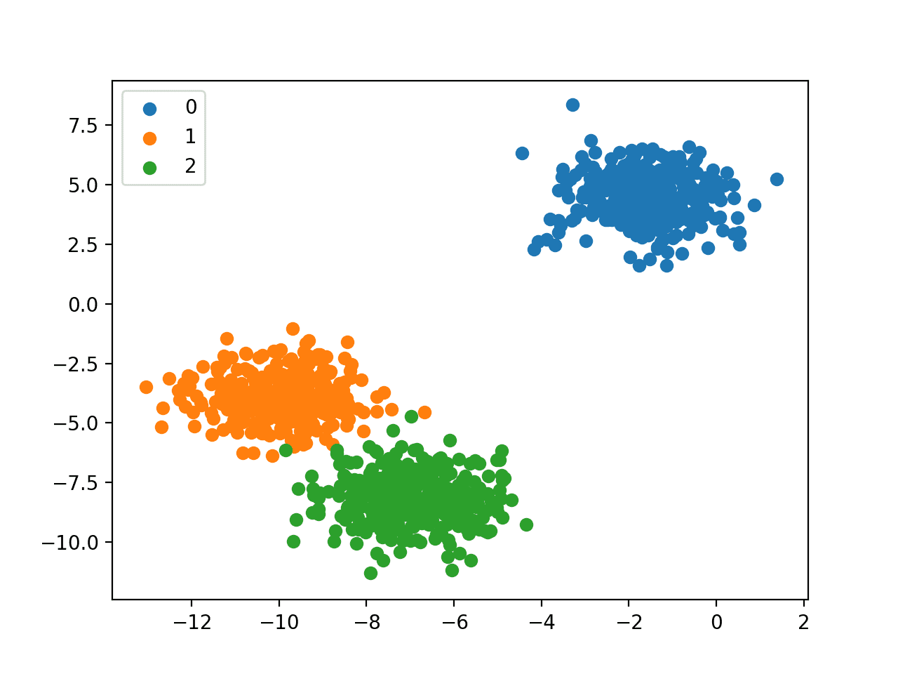

# Classification Models

***

## Introduction 

In this repository we present an application of the main types of classification models, providing a brief explanation of each one of them.
Machine learning classification models are algorithms that automate the process of assigning categories to data or instances. 
They are widely used in a variety of fields such as pattern recognition, natural language processing, medical diagnosis,
and fraud detection, among others. We study the Logistic regression, K-Nearest Neighbors (KNN), Decision Tree model, Support Vector Machines (SVM), and Artificial neural network.

I emphasize the importance of selecting the appropriate classification model for each project, considering the characteristics of the data and 
the requirements of the problem in question. I also highlight the need for techniques such as selection of relevant attributes and hyperparameter 
tuning to optimize model performance. Furthermore, I mention importance of evaluation metrics, such as accuracy, precision, recall and F1-score, 
to measure the quality of predictions and evaluate the performance of models.

| Project Name | Description | 
|---|---|
| 📡 [KNN models]() | | 
| 💡 [Logistic regression]()| |
| 📯 [Naive Bayes model]() |  | 
| ✂️ [Decision Tree model]() |  |
| 🚂 [SVM]()| |
 
